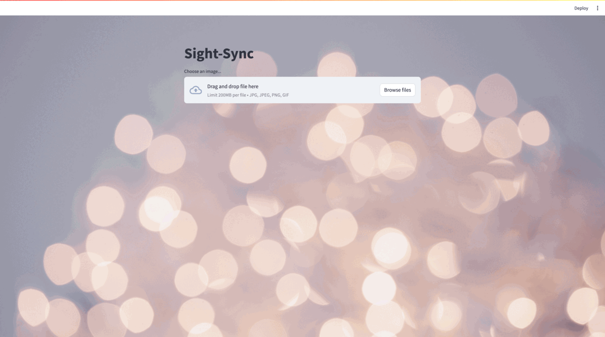

# SightSync

SightSync is an interactive Streamlit application that combines computer vision and natural language processing to generate captions for uploaded images and videos and recommend songs based on those captions using the Spotify API.

# Deployed Application

The application is deployed on HuggingFace. You can access it using the following link:
[SightSync](https://huggingface.co/spaces/vanditgupta/SightSync)


# Features

- **Image Captioning**: Upload an image and get a caption for it using the [nlpconnect/vit-gpt2-image-captioning](https://huggingface.co/nlpconnect/vit-gpt2-image-captioning) HuggingFace model.
- **Song Recommendation**: Get song recommendations based on the caption generated for the uploaded image using the [Spotify API](https://developer.spotify.com/dashboard).
- **Custom Song Recommendation**: Get song recommendations based on the keyword clicked by the user.

## Prerequisites

Before running the application, make sure to have the required libraries installed. You can install them using the following:

1. Create Spotify API credentials by following the instructions [here](https://developer.spotify.com/dashboard)
2. Create a `.env` file in the project directory and add the following credentials:
   ```bash
   SPOTIPY_CLIENT_ID=your_client_id
   SPOTIPY_CLIENT_SECRET=your_client_secret
   ```

3. Create a virtual environment (optional) using the following command:

```bash
python -m venv sightsync
source sightsync/bin/activate
```

4. Clone the repository using the following command:

```bash
git clone https://github.com/VanditGupta/SightSync.git
```
5. Navigate to the project directory using the following command:

```bash
cd SightSync
```

6.Install the required libraries using the following command:

```bash
pip install -r requirements.txt
```

## Running the Application

To run the application, use the following command:

```bash
streamlit run app.py
```

Open the application in your browser:
   ```bash
   http://localhost:PORT_NUMBER/
   ```

## Technologies Used

- [Streamlit](https://streamlit.io/) - The web framework used
- [HuggingFace](https://huggingface.co/) - The model used for image captioning
- [Spotify API](https://developer.spotify.com/dashboard) - The API used for song recommendation
- [PyTorch](https://pytorch.org/) - The deep learning library used for image captioning
- [Spotipy](https://spotipy.readthedocs.io/en/2.18.0/) - The Python library used for the Spotify API


## Working

The user uploads an image, and the Streamlit application uses the [nlpconnect/vit-gpt2-image-captioning](https://huggingface.co/nlpconnect/vit-gpt2-image-captioning) HuggingFace model to generate a caption for the image.
Using NLP techniques, the application first preprocesses the caption and then uses the Spotify API to recommend songs based on the caption.
The user can also click on keywords generate to get song recommendations based on that keyword.



## Screenshots

1. Home Page


2. Image Captioning


3. Song Recommendation


4. Custom Song Recommendation


## Contributing

Contributions are welcome! Please feel free to submit a Pull Request. Please read the CONTRIBUTING.md file for more details.

## License

This project is licensed under the MIT License. Please read the LICENSE.md file for more details.

## Contact

For any inquiries or contributions, please contact me at [gupta.vandi@northeastern.edu](mailto:gupta.vandi@northeastern.edu)

## Project Status

This project is currently in active development. For the latest updates, please check our [GitHub repository](https://github.com/VanditGupta/SightSync).


